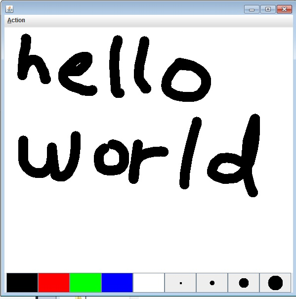

# co painter 
co painter is a drawing tool designed for collaboration between multiple people written in java.

CoPainter is the frontend of co painter 
DrawPath contains the core part of the server and client synchronization details.

#Screenshot

